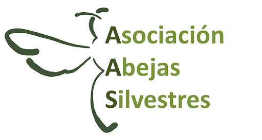

title: `r title_var`
---


<style type="text/css">
  .title{
    display: none;
  }
  body{
  font-size: 13pt;
}


</style>


# <span style="color:darkgreen"> Frutales llenos de vida </span> 

 > Frutas cultivadas de manera  **rentable**  y  **sostenible**, 
   haciendo un uso coherente de los recursos y aprovechando 
   los beneficios de la naturaleza para crear paisajes biodiversos.


## <span style="color:darkgreen"> ¿Quiénes somos? </span> 

Somos un grupo de **investigadores del CSIC**
(Estación Biológica de Doñana)
*Coordinador:* Ignasi Bartomeus  

Formamos parte del proyecto internacional [**SHOWCASE**](https://showcase-project.eu/)(programa europeo H2020: 2021-2025).
  


En este proyecto participan más de 20 instituciones públicas y privadas en toda Europa 
de 10 países. Se trata de un proyecto interdisciplinar que pretende exponer las sinergias entre la agricultura, la biodiversidad y los servicios de los ecosistemas para ayudar a
los agricultores a capitalizar la biodiversidad local.

El **objetivo principal** de este proyecto es **hacer la biodiversidad** una **parte**
**integral** de la **agricultura europea**.

Persigue identificar incentivos para promover la biodiversidad en la agricultura, mostrar evidencias de los beneficios que ello conlleva y comunicar tanto principios como buenas
prácticas a agricultores, políticos y la sociedad en general.

## <span style="color:darkgreen"> ¿Qué buscamos? </span> 

**Agricultores de frutas de hueso** y cooperativas del sector interesados en
participar activamente en la comunidad piloto Gualquivida.

>Estamos localizando:
>
      * Grupo de **20-30 agricultores de frutas de hueso en la Vega del Guadalquivir**
        que estén dispuestos a implementar medidas co-diseñadas e innovadoras en sus fincas.
      * **Gente del sector** de frutas de hueso, tanto personas como
        organizaciones **que quieran compartir su experiencia**, y colaborar en
        el desarrollo del proyecto.
        
        
La comunidad **Guadalquivida** desarrollará **investigación activa y colaborativa** durante el periodo 2021-2023. Esta comunidad será un espacio donde compartir conocimiento y buscar soluciones en común. Entre todos, identificaremos las necesidades y codiseñaremos medidas
eficaces, que integren los intereses de la producción, los beneficios que ofrece la biodiversidad para ello y que ayuden a conservar la naturaleza.

Nos gustaría que esta comunidad sirva de ejemplo y se convierta en un modelo a seguir.

Otros agentes y organizaciones que tengan relación con el sector serán también invitadas a la comunidad, para un diálogo abierto sobre los objetivos del proyecto. Conjuntamente ingeniaremos respuestas a los retos económicos, sociales y ecológicos de la zona. Para ello se realizarán talleres, entrevistas, cuestionarios cortos, desarrollo de prácticas y otras actividades. La participación podrá variar según los intereses y la disponibilidad.

## <span style="color:darkgreen"> ¿Qué ofrecemos? </span> 

Nuestro **conocimiento y experiencia** para:

> * Proveer con información relevante basada en evidencias solidas.
  * Acompañar en el co-diseño de medidas innovadoras.
  * Recursos en la medida de nuestras posibilidades para la implementación
    exitosa de medidas. No ofrecemos subsidios directos.
  * Evaluación de los resultados de forma rigurosa.
  * Identificar conclusiones eficaces.
  
Ofrecemos un **asesoramiento basado en evidencias** y la oportunidad de
beneficiarse de compartir recursos y experiencias. También, ayudaremos
a visibilizar el sector como comprometido con el medioambiente y hacer
llegar las necesidades a las personas que diseñan las políticas agrarias en
Europa.


## <span style="color:darkgreen"> Algunas ideas que ya han ido surgiendo </span> 

En las conversaciones que ya estamos teniendo con agricultores y cooperativas
han surgido algunas ideas y propuestas, por ejemplo:

>  * Desarrollar herramientas sencillas para medir el potencial polinizador de
    las fincas.
  * Evaluación de costes y beneficios de cubiertas y otras infraestructuras
    verdes como bandas florales.
  * Optimizar el uso del agua.
  * Etiquetado y estrategias de diferenciación de mercado.

**Estamos abiertos y encantados de escuchar vuestras ideas.**


## <span style="color:darkgreen"> ¿Quieres participar? </span> 

Para crear esta comunidad nos hemos centrado en el Valle del Guadalquivir. Si eres agricultor, cooperativa, ONG, o cualquier agente involucrado y quieres participar contacta con guadalquivida@gmail.com. Hay muchas maneras de participar, desde dejar oír tu voz, hasta involucrarte implementando las medidas co-diseñadas en tu campo. El único objetivo es que este proyecto sea útil para todos, así que participar en una oportunidad de beneficiarse de recursos y experiencia compartida.

## <span style="color:darkgreen"> Nuestros intereses </span> 

Queremos **dar voz, visibilizar y mostrar evidencias** sobre una manera de
cultivar que permita conservar la naturaleza en los agroecosistemas.
Nuestro objetivo es acompañar y apoyar a agricultores en la producción
de alimentos de manera rentable, aprovechando los recursos naturales de
manera coherente y creando paisajes diversos.
Queremos **fomentar una agricultura con sentido común**. Es decir,
una agricultura que piensa a largo plazo, que está comprometida con
el medioambiente, pero que no se olvide de los agricultores, fomente la
viabilidad productiva y favorezca los beneficios económicos, sociales y
ambientales de los campos de cultivo.


## <span style="color:darkgreen"> Quiénes participamos </span> 

En este mapa iremos situando los actores implicados. De momento, ya contamos con el coordinador, la Estación Biológica de Doñana, con una empresa tecnologica de agricultira de precisión y con la ong [Abejas Silvestres](http://www.abejassilvestres.es).

```{r, echo=FALSE, message=FALSE, warning=FALSE}
library(leaflet)
library(mapr) #Añadir cortijo el puerto? Techcrop?
crop_map <- data.frame(name = c("EBD-CSIC", "PlantPy", "AbejasSilvestres.es"),
                       actor = c("investigación", "empresa", "ong"),
                       latitude = c(37.4121, 37.4762, 37.3873), 
                       longitude= c(-6.0056, -5.9519, -6.0386))
m <- map_leaflet(x = crop_map, color = c("red", "blue", "green"))
m %>% addTiles('http://{s}.tile.openstreetmap.org/{z}/{x}/{y}.png')
```


## <span style="color:darkgreen"> Preguntas frecuentes: </span> 

- *¿Solo estáis actuando en el valle del Guadalquivir?* Como comunidad piloto, sí. Pero pronto empezaremos a generar documentación y recursos para poder auto-organizarse en otras regiones y estaremos encantados de echar una mano compartiendo nuestra experiencia.   

- *¿Qué ofrecéis exactamente?* Ofrecemos conocimiento e información para diseñar, y sobretodo, para evaluar el resultado de innovaciones de forma rigurosa. También podemos ofrecer recursos para implementar acciones co-diseñadas en la medida de nuestras posibilidades (pero no subsidios directos). Ofrecemos la potencia de un proyecto Europeo con voz en europa para hacer llegar tu voz a las personas que diseñan la futura política agraria europea.    

- *¿Y qué esperáis de los participantes exactamente?* Compartir conocimiento mediante talleres, entrevistas o cuestionarios cortos. Todos vamos muy ocupados, así que estos van a ser cortos y productivos. Si eres agricultor, buscamos 15 fincas que quieran involucrarse en realizar innovaciones basadas en la biodiversidad co-diseñadas con nosotros. También buscamos 15 fincas que no quieran hacer acciones específicas, pero nos dejen acceso para medir biodiversidad y producción. Todos los datos serán anonimizados.


------

    
**Con la colaboración de:**   



