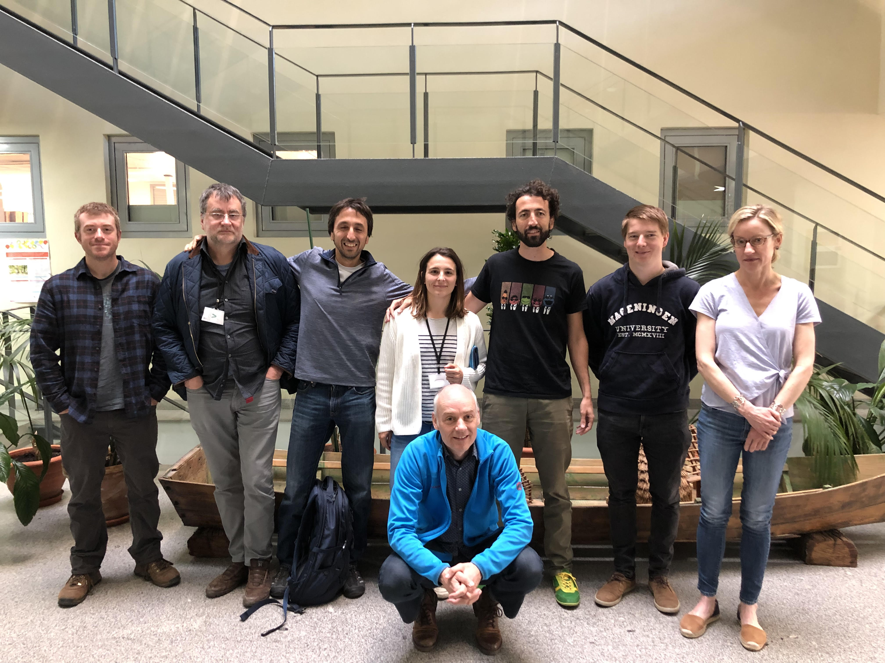

## Open library of pollinator Biodiversity and ecosystem Services scenarios  
**Funded by:**  

  
**Coordinator:** Ignasi Bartomeus (EBD-CSIC)  
**Partner:** Lucas Garibaldi (URN)  
**Partner:** Rachael Winfree (Rutgers)  
**Partner:** David Kleijn (Wageningen)  
**Partner:** Ferdinando Villa (BC3)  


> The OBServ project OBServ aims to co-develop a user-friendly open library of pollinator biodiversity and ecosystem service models which can be used to deliver local and global predictive maps based on different environmental scenarios. In order to achieve this we will specifically (i) capture stakeholder needs and broader socio-economic dimensions of biodiversity, (ii) expand biodiversity models beyond species richness, and (iii) compare and validate predictions of data- driven, statistical and mechanistic biodiversity models.

## The Team:

```{r, echo=FALSE, message=FALSE, warning=FALSE}
library(mapr)
partners <- data.frame(name = c("EBD-CSIC", "BC3", "Wageningen", "Rutgers", "Rio Negro"),
                       Partner = c("Ignasi Bartomeus", "Ferdinando Villa", "David Kleijn", "Rachael Winfree", "Lucas Garibaldi"),
                       latitude = c(37.385768, 43.327786, 51.985776, 40.480032, -41.146367), 
                       longitude= c(-5.981614, -2.965836, 5.662882, -74.436096, -71.306643))
map_leaflet(x = partners) 
```

## What do we do at OBServ?

<iframe width="560" height="315" src="https://www.youtube.com/embed/QTuf3uoyVhw" title="YouTube video player" frameborder="0" allow="accelerometer; autoplay; clipboard-write; encrypted-media; gyroscope; picture-in-picture" allowfullscreen></iframe>

## News  

* [Twitter chat](https://wakelet.com/wake/FgcLUM2b_fYkon5QvGufu) about pollination services
* Our 2020 anual meeting was all virtual due to the pandemic, but it was a success!
* We are launching a **[Global Crop Pollintion Database](croppollination.html)**
* OBServ was highly represented at [ECOFLOR 2020](https://ecoflor2020.weebly.com/)
* See a demo of the amaizing kLab environemnt that we will be using: [link](https://www.youtube.com/watch?v=vsWGkMBpI9Y&feature=youtu.be)  
* Group photo of our kick-off meeting:  
  
_Featuring Rachael Winfree, James Rilley, Ignasi Bartomeus, Ainhoa Magrach, Ferdinando Villa, David Kleijn, Lucas Garibaldi and Thijs Fijen._  

## Papers published  

- **Bartomeus**, I. and Dicks, L.V., 2019. The need for coordinated transdisciplinary research infrastructures for pollinator conservation and crop pollination resilience. Environmental Research Letters, 14(4), p.045017.   [link](https://iopscience.iop.org/article/10.1088/1748-9326/ab0cb5)
- **Garibaldi**, L.A., Sáez, A., Aizen, M.A., **Fijen**, T. and **Bartomeus**, I., 2020. Crop pollination management needs flower‐visitor monitoring and target values. Journal of Applied Ecology, 57(4), pp.664-670.   [link](https://besjournals.onlinelibrary.wiley.com/doi/abs/10.1111/1365-2664.13574)
- **Reilly**, J.R., Artz, D.R., Biddinger, D., Bobiwash, K., Boyle, N.K., Brittain, C., Brokaw, J., Campbell, J.W., Daniels, J., Elle, E. and Ellis, J.D., 2020. Crop production in the USA is frequently limited by a lack of pollinators. Proceedings of the Royal Society B, 287(1931), p.20200922. [link](https://royalsocietypublishing.org/doi/abs/10.1098/rspb.2020.0922?casa_token=nDj4Boq0kwUAAAAA:LyPCrCTqCO8lA3FoEWCosjc5rqUm7RwTtXxsaFO4lZK0l5qkzxczibHdQ7eWBzsKu7RS1psdxEG54g)    
- **Fijen**, T. 2020. Mass‐migrating bumblebees: An overlooked phenomenon with potential far‐reaching implications for bumblebee conservation. Journal of Applied Ecology. 00: 1– 7 [Link](https://besjournals.onlinelibrary.wiley.com/doi/10.1111/1365-2664.13768)   
- **Garibaldi**, LA, **Oddi**, FJ, Miguez, FE, **Bartomeus**, I, et al. Working landscapes need at least 20% native habitat. Conservation Letters. 2020;e12773. [Link](https://doi.org/10.1111/conl.12773)     
- Zamorano, J., **Bartomeus**, I., Grez, A.A. and **Garibaldi**, L.A. (2020), Field margin floral enhancements increase pollinator diversity at the field edge but show no consistent spillover into the crop field: a meta‐analysis. Insect Conserv Divers, 13: 519-531. [Link](https://doi.org/10.1111/icad.12454)    
- Blasi, **Bartomeus**, Bommarco, Gagic, Garratt, Holzschuh, **Kleijn**, Lindström, Olsson, Polce, Potts, Rundlöf, Scheper, Smith, Steffan-Dewenter, Clough. 2021. Evaluating predictive performance of models explaining wild bee pollinator abundance in a mass-flowering crops. In press.  [Link](https://onlinelibrary.wiley.com/doi/full/10.1111/ecog.05308)   

_How to acknowledge OBServ:
"This research was funded through the 2017-2018 Belmont Forum and BiodivERsA joint call for research proposals, under the BiodivScen ERA-Net COFUND programme, and with the funding organisations AEI, NWO, ECCyT and NSF"_


------
**Funded by:**  


